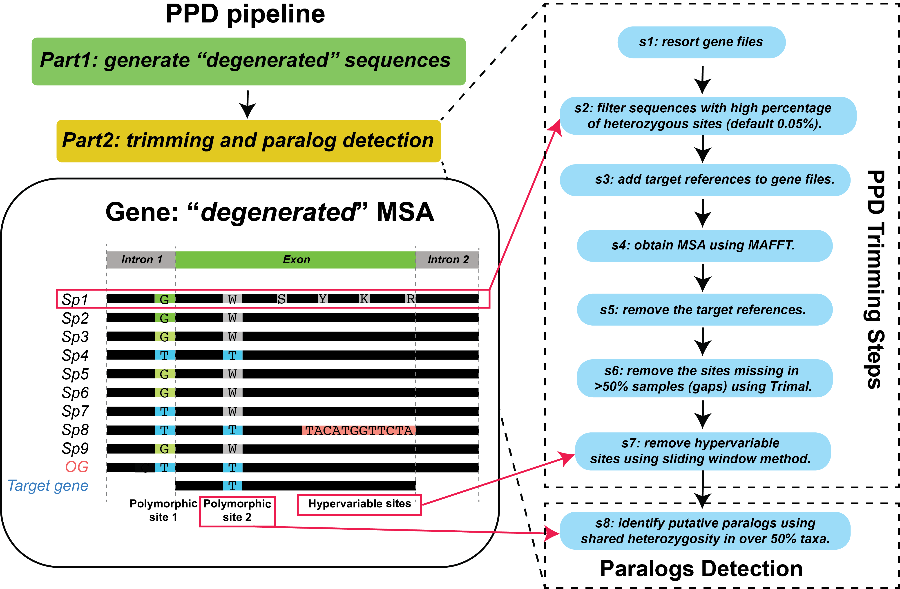

# Putative Paralogs Detection (PPD)
-- [read our article soon!]()
by Wenbin Zhou and John Soghigian

This method is based on shared heterozygous information to detect putative paralogs for Hyb-Seq data. Highly recommended for Hyb-Seq downstream analysis after [HybPiper](https://github.com/mossmatters/HybPiper).

## Prerequisites:
Run the main [HybPiper](https://github.com/mossmatters/HybPiper) script and check the results in [individual]/[gene]/[individual]/sequences/intron/ and [individual]/[gene]/[individual]/sequences/FNA/ directories.

All the intron and exon sequences are considered as input for Step1.

## Software/dependencies

1. [Picard](http://broadinstitute.github.io/picard/) for Step2.
```
check if picard is installed successfully by typing "picard -h" in terminal.
```

2. [GATK](https://software.broadinstitute.org/gatk/download/) for Step2.

```
check if GATK is installed successfully by typing "gatk -h" in terminal.
```

3. [python](https://www.python.org/downloads/) and its dependencies for Step3.
* [Biopython](https://biopython.org/wiki/Packages). Easy installation from [conda](https://biopython.org/wiki/Packages) 
* [numpy](https://numpy.org/doc/stable/user/whatisnumpy.html). Easy installation from [conda](https://anaconda.org/anaconda/numpy)

4. [MAFFT](https://mafft.cbrc.jp/alignment/software/) for Step3. Easy installation from [conda](https://anaconda.org/bioconda/mafft)

```
check if MAFFT is installed successfully by typing "mafft -h" in terminal.
```

5. [trimAl](http://trimal.cgenomics.org/) for Step3. Easy installation from [conda](https://anaconda.org/bioconda/trimal)

```
check if trimAl is installed successfully by typing "trimal -h" in terminal.
```

## Environment
Examples can be run on Mac or Linux.

## Steps
It includes three steps as follows:

1. Step1: Concatenate all the supercontigs into a single file. All supercontigs are stored in two new files named supercontig and exon.
  This script is modified from [Mossmatters github "Alleles from HybSeq Data"](https://github.com/mossmatters/phyloscripts/tree/master/alleles_workflow).
  
  ```
  Please type in the following arguments after Step1.sh in order: 
  * The direcotory HybPiper.
  * full name of namelist.
  
  Example: ./Step1.sh ./HybPiper-master/[Hybpiper_result_file]/ [full_path]/namelist.txt
  ```
  
2. Step2: Generate the degenerated seuqences using IPUAC codes.
This script is modified from [Mossmatters github "Alleles from HybSeq Data"](https://github.com/mossmatters/phyloscripts/tree/master/alleles_workflow).

```
  "Please type in the following arguments after Step2.sh in order: 
  1. BWA -k matching base length (if raw reads are 150 bp, we recommand use 100 bp here). 
  2. ploidy number of a species (2, 3, 4 ...)
  3. a direcotory containing consensus sequences from Step1.
  4. a directory containing all raw reads file after QC control (keep raw reads in fastq.gz format).
  5. output directory (to keep the degerated sequences file, which will be used for Step3).
  6. full name of namelist.
  
  Example: ./Step2.sh 100 2 [Step1_output_path] [QC_raw_reads_path] [output_directory] [full_path]/namelist.txt
```
##### Note
```
Please check Step2 result contains all sequences from all individuals. If not, you can generate a new subset namelist file and run the Step2 again.
```

3. Step3: Conduct downstream analysis for matrices with heterozyous sites information.
It includes 8 steps.




  This script is used to find putative paralogs in 353 enrichment data. It requires three input components and one output component. The '-he' and '-hs' are not necessary. -ifa, -ina, -iref, -io, -o are required arguments
  
  To check all parameters in PPD.py using:
  ```python
  python PPD.py -h
  ```
  
```python
usage: PPD.py [-h] [-ifa INPUT_DIR] [-ina INPUT_SP_NAME]
                  [-iref INPUT_REF_SEQ] [-io INPUT_OUTGROUP] [-o OUTPUT_DIR]
                  [-t SEQ_TYPE] [-he HSITE_VALUE] [-hs HS_MAX_VALUE]
                  [-w WINDOW_SIZE] [-m MAX_P_SITE]

optional arguments:
  -h, --help            show this help message and exit
  -ifa INPUT_DIR, --inputfastadir INPUT_DIR
                        the directory where degenerated fasta files deposits, which are generated by Step2
  -ina INPUT_SP_NAME, --inputspna INPUT_SP_NAME
                        the full path of namelist.txt with every accession in one line
  -iref INPUT_REF_SEQ, --inputref INPUT_REF_SEQ
                        the full path of reference seq, which is as same as the one in Hybpiper. Fasta format. The reference name should be like "SPECIESNAME-GENENAME". Please Capitalize them.
  -io INPUT_OUTGROUP, --inputoutgroup INPUT_OUTGROUP
                        the full path of outgroups.txt. Every line has one accession
  -o OUTPUT_DIR, --output OUTPUT_DIR
                        output path. You can run supercontig and exon with same path, but you should change your path when you are running another group of taxa.
  -t SEQ_TYPE, --seqtype SEQ_TYPE
                        It can be supercontig or exon data type. Default is supercontig
  -he HSITE_VALUE, --Hsites HSITE_VALUE
                        Maximum percentage of heterozygous site in a sequence. The default value is 0.05 (means 5%).
  -hs HS_MAX_VALUE, --Hs HS_MAX_VALUE
                        Maximum shared heterozygous percentage at a site. The default value is 0.5 (means 50%).
  -w WINDOW_SIZE, --windowsize WINDOW_SIZE
                        setting the sliding window size. The default is 20 bp.
  -m MAX_P_SITE, --maxpsite MAX_P_SITE
                        The number of polymorphism site in each sliding window without outgroup. Default is 5.

```

## Citation

* Zhou et al., A New Paralog Removal Pipeline Resolves Conflict between RAD-Seq and Enrichment. in prep.

* Kates, H.R., Johnson, M.G., Gardner, E.M., Zerega, N.J. and Wickett, N.J., 2018. Allele phasing has minimal impact on phylogenetic reconstruction from targeted nuclear gene sequences in a case study of Artocarpus. American journal of botany, 105(3), pp.404-416.
